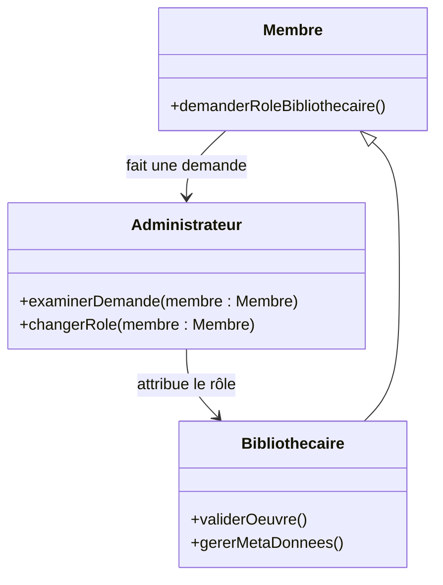

# Diagramme pour le scénario *Devenir bibliothécaire*

```mermaid
classDiagram
    class Membre {
        +demanderRoleBibliothecaire()
    }

    class Bibliothecaire {
        +validerOeuvre()
        +gererMetaDonnees()
    }

    class Administrateur {
        +examinerDemande(membre : Membre)
        +changerRole(membre : Membre)
    }

    Membre --> Administrateur : fait une demande
    Administrateur --> Bibliothecaire : attribue le rôle
    Membre <|-- Bibliothecaire

```

## [Back](../README.md)