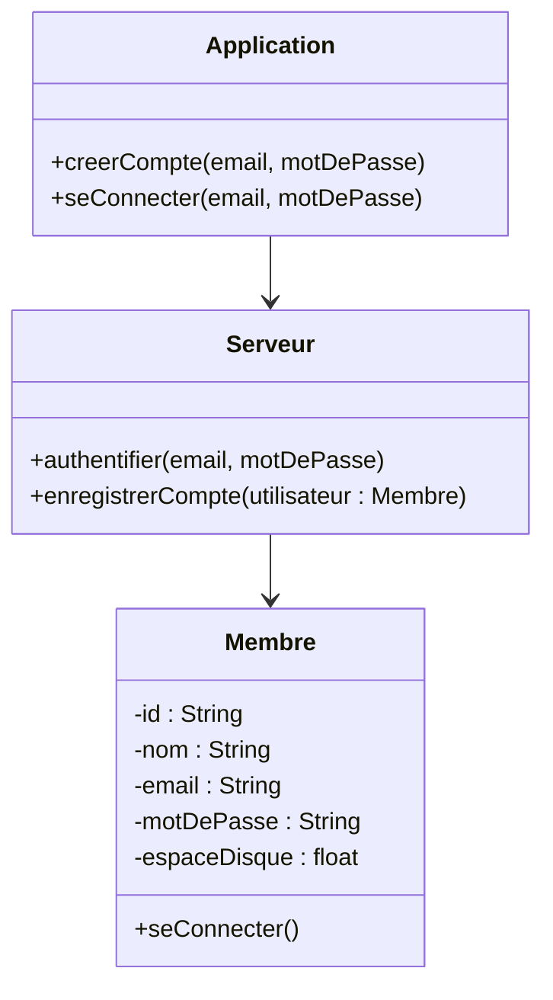

# Diagramme pour le scénario *Devenir membre / Se connecter* 

```mermaid
classDiagram
    class Application {
        +creerCompte(email, motDePasse)
        +seConnecter(email, motDePasse)
    }

    class Serveur {
        +authentifier(email, motDePasse)
        +enregistrerCompte(utilisateur : Membre)
    }

    class Membre {
        -id : String
        -nom : String
        -email : String
        -motDePasse : String
        -espaceDisque : float
        +seConnecter()
    }

    Application --> Serveur
    Serveur --> Membre

```

## [Back](../README.md)