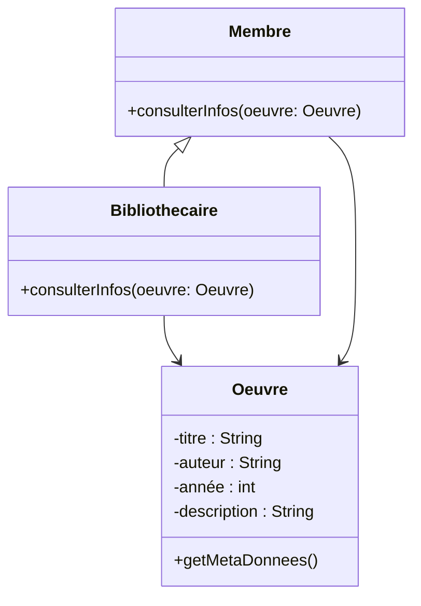

# Diagramme de classes pour le scénario *Consulter les informations concernant une oeuvre*

```mermaid
classDiagram
    class Membre{
        +consulterInfos(oeuvre: Oeuvre)
    }

    class Bibliothecaire {
        +consulterInfos(oeuvre: Oeuvre)
    }

    class Oeuvre {
        -titre : String
        -auteur : String
        -année : int
        -description : String
        +getMetaDonnees()
    }

    Membre <|-- Bibliothecaire
    Bibliothecaire --> Oeuvre
    Membre --> Oeuvre
```

## [Back](../README.md)