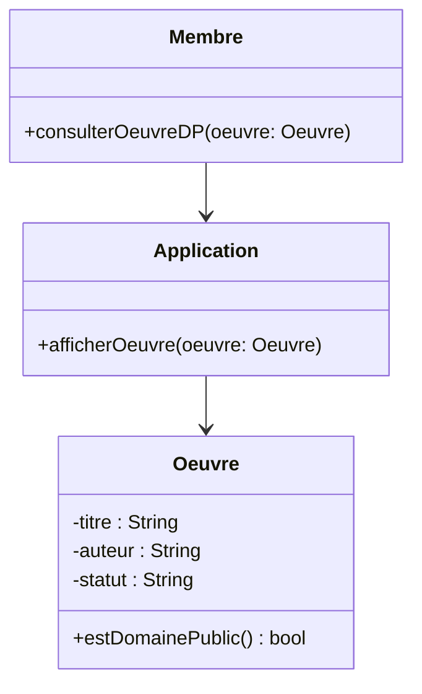

# Diagramme de classes pour le scénario *Consulter une oeuvre du domaine public*

```mermaid
classDiagram
    class Membre {
        +consulterOeuvreDP(oeuvre: Oeuvre)
    }

    class Oeuvre {
        -titre : String
        -auteur : String
        -statut : String
        +estDomainePublic() bool
    }

    class Application {
        +afficherOeuvre(oeuvre: Oeuvre)
    }

    Membre --> Application
    Application --> Oeuvre
```