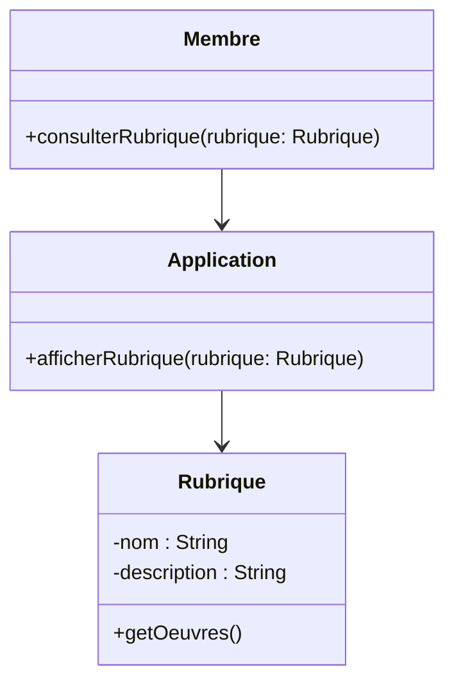

# Diagramme de classes pour le scénario *Consulter les rubriques*

```mermaid
classDiagram
    class Membre {
        +consulterRubrique(rubrique: Rubrique)
    }

    class Rubrique {
        -nom : String
        -description : String
        +getOeuvres()
    }

    class Application {
        +afficherRubrique(rubrique: Rubrique)
    }

    Membre --> Application
    Application --> Rubrique
```