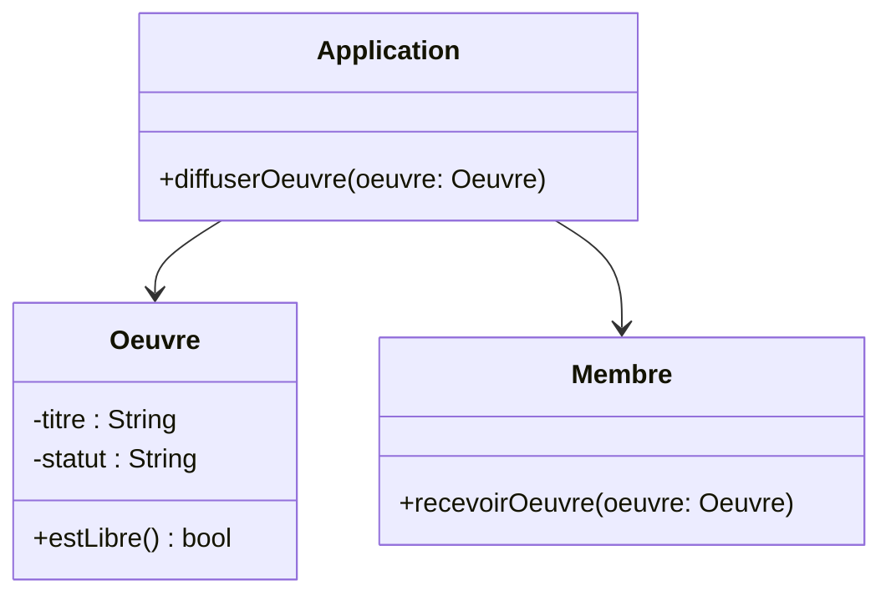

# Diagramme de classes pour le scénario *Diffuser une oeuvre libre de droits*

```mermaid
classDiagram
    class Application {
        +diffuserOeuvre(oeuvre: Oeuvre)
    }

    class Oeuvre {
        -titre : String
        -statut : String
        +estLibre() bool
    }

    class Membre {
        +recevoirOeuvre(oeuvre: Oeuvre)
    }

    Application --> Oeuvre
    Application --> Membre
```