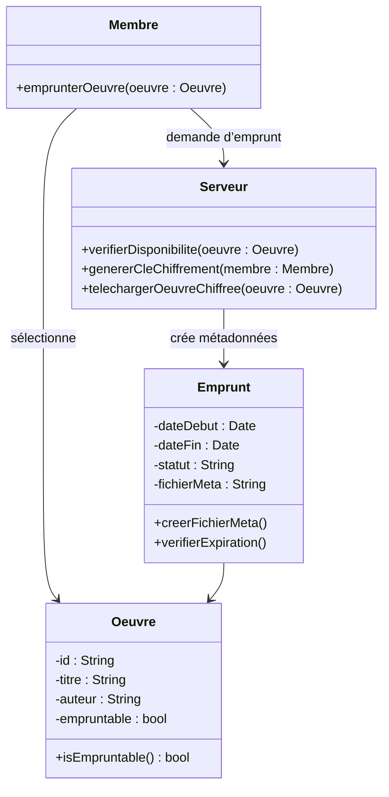

# Diagramme pour le scénario *Emprunter une oeuvre sous droit*

```mermaid
classDiagram
    class Membre {
        +emprunterOeuvre(oeuvre : Oeuvre)
    }

    class Oeuvre {
        -id : String
        -titre : String
        -auteur : String
        -empruntable : bool
        +isEmpruntable() bool
    }

    class Emprunt {
        -dateDebut : Date
        -dateFin : Date
        -statut : String
        -fichierMeta : String
        +creerFichierMeta()
        +verifierExpiration()
    }

    class Serveur {
        +verifierDisponibilite(oeuvre : Oeuvre)
        +genererCleChiffrement(membre : Membre)
        +telechargerOeuvreChiffree(oeuvre : Oeuvre)
    }

    Membre --> Oeuvre : sélectionne
    Membre --> Serveur : demande d’emprunt
    Serveur --> Emprunt : crée métadonnées
    Emprunt --> Oeuvre

```

## [Back](../README.md)