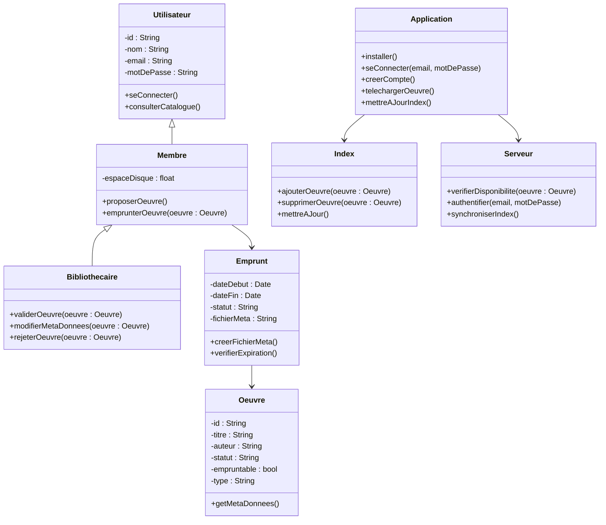

# Diagramme de classe global (vues systèmes) 

```mermaid
classDiagram
    class Application {
        +installer()
        +seConnecter(email, motDePasse)
        +creerCompte()
        +telechargerOeuvre()
        +mettreAJourIndex()
    }

    class Utilisateur {
        -id : String
        -nom : String
        -email : String
        -motDePasse : String
        +seConnecter()
        +consulterCatalogue()
    }

    class Membre {
        -espaceDisque : float
        +proposerOeuvre()
        +emprunterOeuvre(oeuvre : Oeuvre)
    }

    class Bibliothecaire {
        +validerOeuvre(oeuvre : Oeuvre)
        +modifierMetaDonnees(oeuvre : Oeuvre)
        +rejeterOeuvre(oeuvre : Oeuvre)
    }

    class Oeuvre {
        -id : String
        -titre : String
        -auteur : String
        -statut : String
        -empruntable : bool
        -type : String
        +getMetaDonnees()
    }

    class Emprunt {
        -dateDebut : Date
        -dateFin : Date
        -statut : String
        -fichierMeta : String
        +creerFichierMeta()
        +verifierExpiration()
    }

    class Index {
        +ajouterOeuvre(oeuvre : Oeuvre)
        +supprimerOeuvre(oeuvre : Oeuvre)
        +mettreAJour()
    }

    class Serveur {
        +verifierDisponibilite(oeuvre : Oeuvre)
        +authentifier(email, motDePasse)
        +synchroniserIndex()
    }

Application --> Serveur
Application --> Index
Utilisateur <|-- Membre
Membre <|-- Bibliothecaire
Membre --> Emprunt
Emprunt --> Oeuvre
```

## [Back](../README.md)