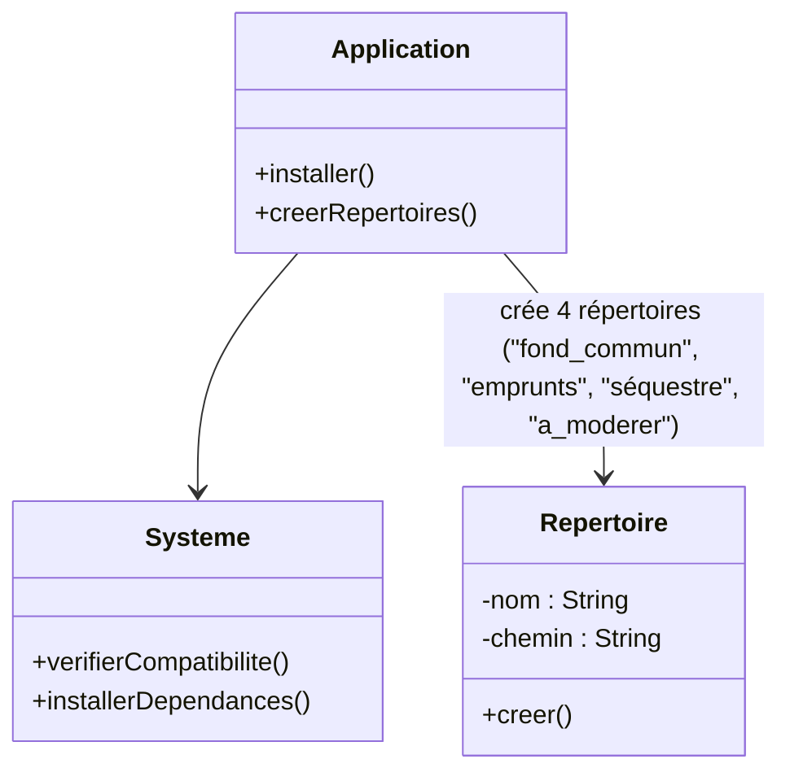

# Diagramme pour le scénario *Installer l'application*

```mermaid
classDiagram
    class Application {
        +installer()
        +creerRepertoires()
    }

    class Systeme {
        +verifierCompatibilite()
        +installerDependances()
    }

    class Repertoire {
        -nom : String
        -chemin : String
        +creer()
    }

    Application --> Systeme
    Application --> Repertoire : crée 4 répertoires ("fond_commun", "emprunts", "séquestre", "a_moderer")

```

## [Back](../README.md)