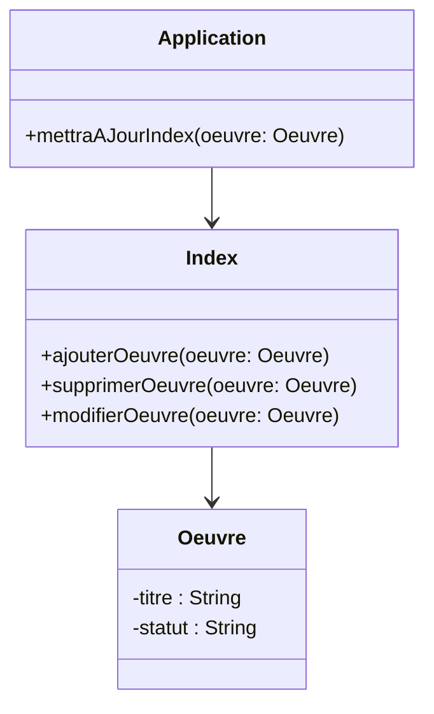

# Diagramme de classes pour le scénario *Mettre à jour l'index des oeuvres*

```mermaid
classDiagram
    class Application {
        +mettraAJourIndex(oeuvre: Oeuvre)
    }

    class Index {
        +ajouterOeuvre(oeuvre: Oeuvre)
        +supprimerOeuvre(oeuvre: Oeuvre)
        +modifierOeuvre(oeuvre: Oeuvre)
    }

    class Oeuvre {
        -titre : String
        -statut : String
    }

    Application --> Index
    Index --> Oeuvre
```