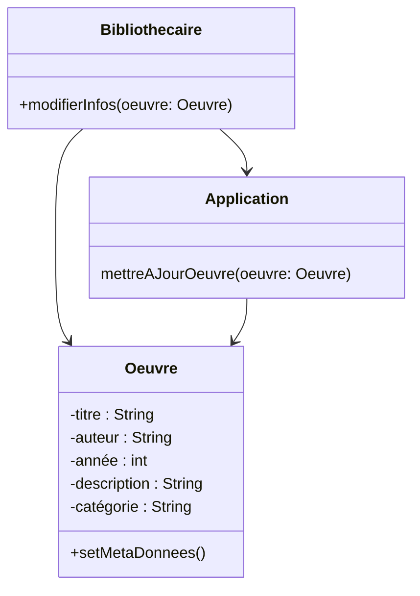

# Diagramme de classes pour le scénario *Modifier les informations d'une oeuvre*

```mermaid
classDiagram
    class Bibliothecaire {
        +modifierInfos(oeuvre: Oeuvre)
    }

    class Oeuvre {
        -titre : String
        -auteur : String
        -année : int
        -description : String
        -catégorie : String
        +setMetaDonnees()
    }

    class Application {
        mettreAJourOeuvre(oeuvre: Oeuvre)
    }

    Bibliothecaire --> Oeuvre
    Bibliothecaire --> Application
    Application --> Oeuvre
```