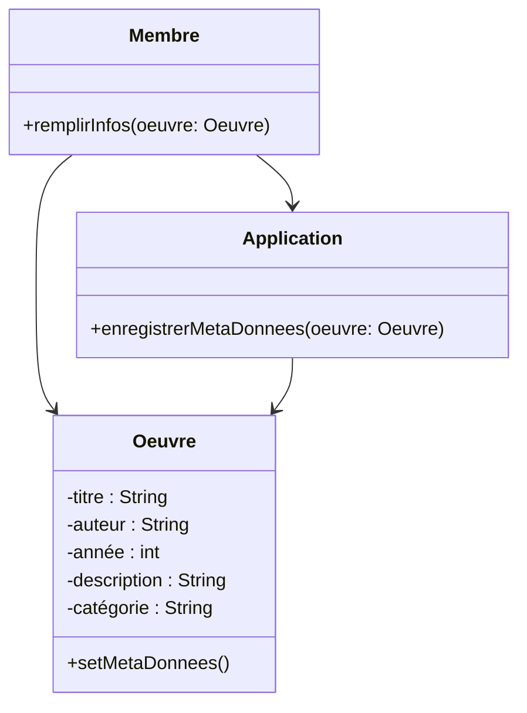

# Diagramme de classes pour le scénario *Remplir les informations concernant une oeuvre*

```mermaid
classDiagram
    class Oeuvre {
        -titre : String
        -auteur : String
        -année : int
        -description : String
        -catégorie : String
        +setMetaDonnees()
    }

    class Membre {
        +remplirInfos(oeuvre: Oeuvre)
    } 

    class Application {
        +enregistrerMetaDonnees(oeuvre: Oeuvre)
    }

    Membre --> Oeuvre
    Membre --> Application
    Application --> Oeuvre
```