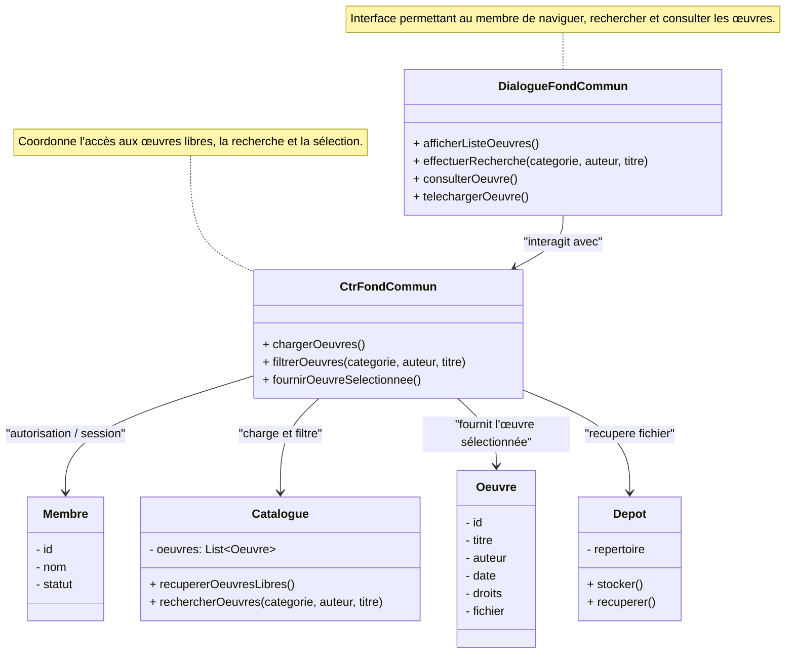

```mermaid
classDiagram
%% ===============================
%% Diagramme de Classes du Problème (DCP)
%% Cas d’utilisation : Consultation de la rubrique "Fond commun"
%% ===============================

%% --- Dialogues (IHM) ---
class DialogueFondCommun {
  + afficherListeOeuvres()
  + effectuerRecherche(categorie, auteur, titre)
  + consulterOeuvre()
  + telechargerOeuvre()
}

%% --- Contrôles ---
class CtrFondCommun {
  + chargerOeuvres()
  + filtrerOeuvres(categorie, auteur, titre)
  + fournirOeuvreSelectionnee()
}

%% --- Entités (métier) ---
class Membre {
  - id
  - nom
  - statut
}

class Oeuvre {
  - id
  - titre
  - auteur
  - date
  - droits
  - fichier
}

class Catalogue {
  - oeuvres: List~Oeuvre~
  + recupererOeuvresLibres()
  + rechercherOeuvres(categorie, auteur, titre)
}

class Depot {
  - repertoire
  + stocker()
  + recuperer()
}

%% --- Relations (liens fonctionnels) ---
DialogueFondCommun --> CtrFondCommun : "interagit avec"

CtrFondCommun --> Membre : "autorisation / session"
CtrFondCommun --> Catalogue : "charge et filtre"
CtrFondCommun --> Oeuvre : "fournit l'œuvre sélectionnée"
CtrFondCommun --> Depot : "recupere fichier"

%% --- Notes UML ---
note for CtrFondCommun "Coordonne l'accès aux œuvres libres, la recherche et la sélection."
note for DialogueFondCommun "Interface permettant au membre de naviguer, rechercher et consulter les œuvres."
```