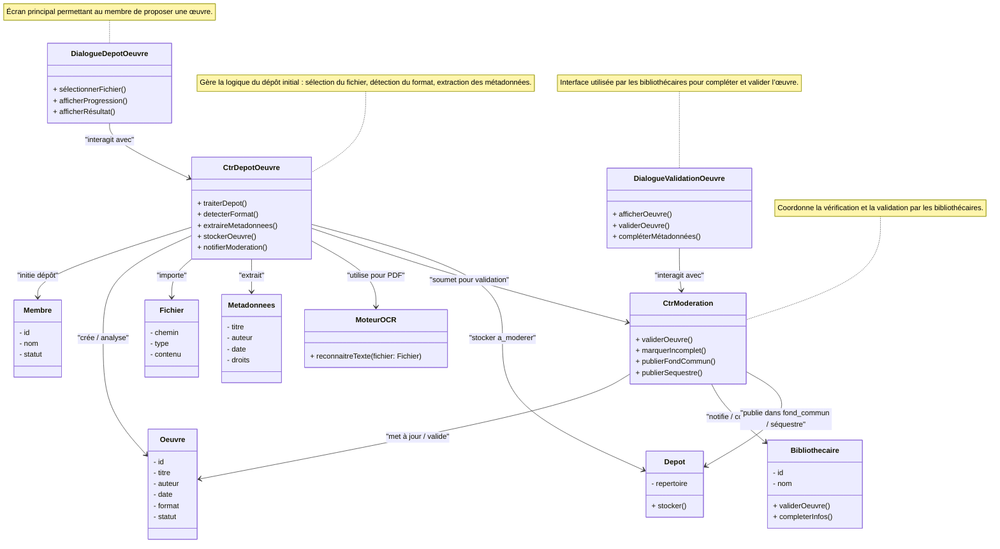

```mermaid
classDiagram
%% ===============================
%% Diagramme de Classes du Problème (DCP)
%% Cas d’utilisation : Déposer une œuvre numérisée
%% ===============================

%% --- Dialogues (IHM) ---
class DialogueDepotOeuvre {
  + sélectionnerFichier()
  + afficherProgression()
  + afficherRésultat()
}

class DialogueValidationOeuvre {
  + afficherOeuvre()
  + validerOeuvre()
  + compléterMétadonnées()
}

%% --- Contrôles ---
class CtrDepotOeuvre {
  + traiterDepot()
  + detecterFormat()
  + extraireMetadonnees()
  + stockerOeuvre()
  + notifierModeration()
}

class CtrModeration {
  + validerOeuvre()
  + marquerIncomplet()
  + publierFondCommun()
  + publierSequestre()
}

%% --- Entités (métier) ---
class Membre {
  - id
  - nom
  - statut
}

class Oeuvre {
  - id
  - titre
  - auteur
  - date
  - format
  - statut
}

class Fichier {
  - chemin
  - type
  - contenu
}

class Metadonnees {
  - titre
  - auteur
  - date
  - droits
}

class MoteurOCR {
  + reconnaitreTexte(fichier: Fichier)
}

class Bibliothecaire {
  - id
  - nom
  + validerOeuvre()
  + completerInfos()
}

class Depot {
  - repertoire
  + stocker()
}

%% --- Relations (liens fonctionnels) ---
DialogueDepotOeuvre --> CtrDepotOeuvre : "interagit avec"
DialogueValidationOeuvre --> CtrModeration : "interagit avec"

CtrDepotOeuvre --> Membre : "initie dépôt"
CtrDepotOeuvre --> Oeuvre : "crée / analyse"
CtrDepotOeuvre --> Fichier : "importe"
CtrDepotOeuvre --> Metadonnees : "extrait"
CtrDepotOeuvre --> MoteurOCR : "utilise pour PDF"
CtrDepotOeuvre --> CtrModeration : "soumet pour validation"
CtrDepotOeuvre --> Depot : "stocker a_moderer"

CtrModeration --> Oeuvre : "met à jour / valide"
CtrModeration --> Bibliothecaire : "notifie / consulte"
CtrModeration --> Depot : "publie dans fond_commun / séquestre"

%% --- Notes UML ---
note for CtrDepotOeuvre "Gère la logique du dépôt initial : sélection du fichier, détection du format, extraction des métadonnées."
note for CtrModeration "Coordonne la vérification et la validation par les bibliothécaires."
note for DialogueDepotOeuvre "Écran principal permettant au membre de proposer une œuvre."
note for DialogueValidationOeuvre "Interface utilisée par les bibliothécaires pour compléter et valider l’œuvre."
```
