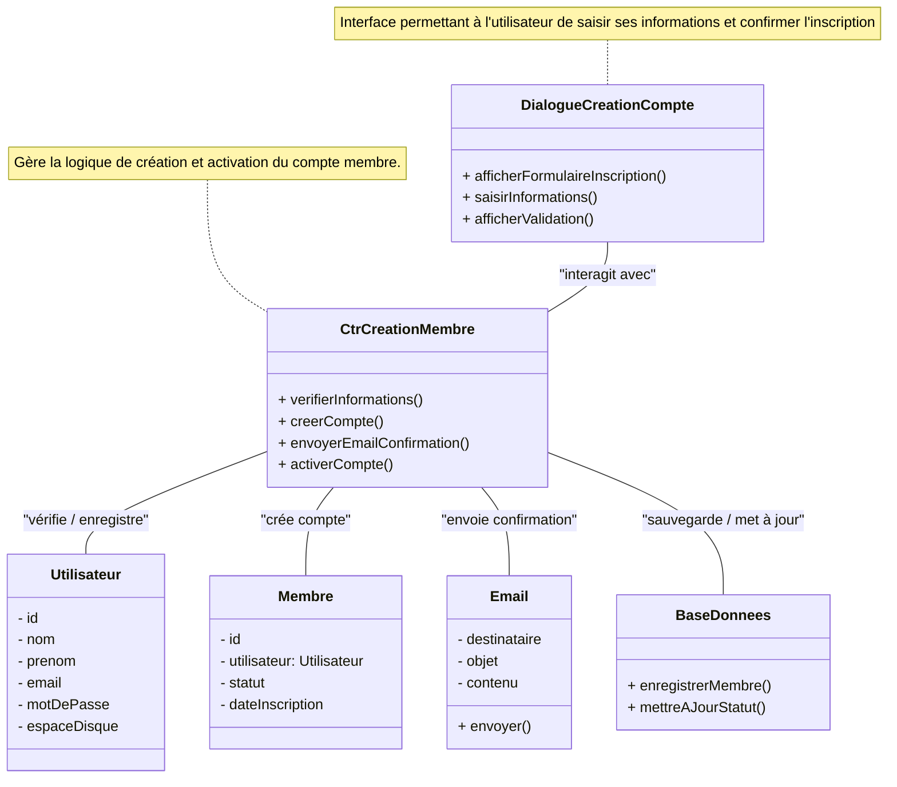

```mermaid
classDiagram
%% ===============================
%% Diagramme de Classes du Problème (DCP)
%% Cas d’utilisation : Devenir membre
%% ===============================

%% --- Dialogues (IHM) ---
class DialogueCreationCompte {
  + afficherFormulaireInscription()
  + saisirInformations()
  + afficherValidation()

}

%% --- Contrôles ---
class CtrCreationMembre {
  + verifierInformations()
  + creerCompte()
  + envoyerEmailConfirmation()
  + activerCompte()
}

%% --- Entités (métier) ---
class Utilisateur {
  - id
  - nom
  - prenom
  - email
  - motDePasse
  - espaceDisque
}

class Membre {
  - id
  - utilisateur: Utilisateur
  - statut
  - dateInscription
}

class Email {
  - destinataire
  - objet
  - contenu
  + envoyer()
}

class BaseDonnees {
  + enregistrerMembre()
  + mettreAJourStatut()
}

%% --- Relations (liens fonctionnels) ---
DialogueCreationCompte -- CtrCreationMembre : "interagit avec"

CtrCreationMembre -- Utilisateur : "vérifie / enregistre"
CtrCreationMembre -- Membre : "crée compte"
CtrCreationMembre -- Email : "envoie confirmation"
CtrCreationMembre -- BaseDonnees : "sauvegarde / met à jour"

%% --- Notes UML ---
note for CtrCreationMembre "Gère la logique de création et activation du compte membre."
note for DialogueCreationCompte "Interface permettant à l'utilisateur de saisir ses informations et confirmer l'inscription"
```