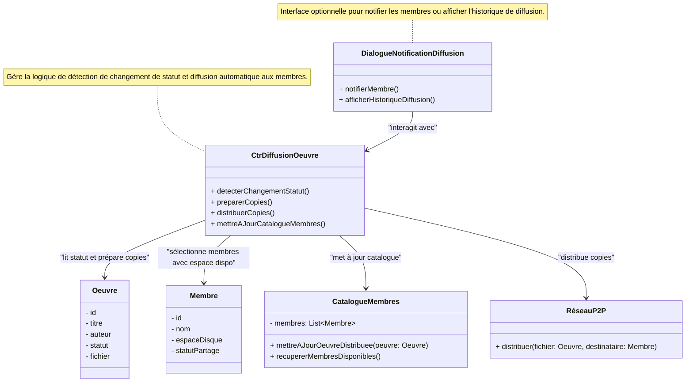

```mermaid
classDiagram
%% ===============================
%% Diagramme de Classes du Problème (DCP)
%% Cas d’utilisation : Diffusion d'une oeuvre libre de droits
%% ===============================

%% --- Dialogues (IHM) ---
class DialogueNotificationDiffusion {
  + notifierMembre()
  + afficherHistoriqueDiffusion()
}

%% --- Contrôles ---
class CtrDiffusionOeuvre {
  + detecterChangementStatut()
  + preparerCopies()
  + distribuerCopies()
  + mettreAJourCatalogueMembres()
}

%% --- Entités (métier) ---
class Oeuvre {
  - id
  - titre
  - auteur
  - statut
  - fichier
}

class Membre {
  - id
  - nom
  - espaceDisque
  - statutPartage
}

class CatalogueMembres {
  - membres: List~Membre~
  + mettreAJourOeuvreDistribuee(oeuvre: Oeuvre)
  + recupererMembresDisponibles()
}

class RéseauP2P {
  + distribuer(fichier: Oeuvre, destinataire: Membre)
}

%% --- Relations (liens fonctionnels) ---
DialogueNotificationDiffusion --> CtrDiffusionOeuvre : "interagit avec"

CtrDiffusionOeuvre --> Oeuvre : "lit statut et prépare copies"
CtrDiffusionOeuvre --> Membre : "sélectionne membres avec espace dispo"
CtrDiffusionOeuvre --> CatalogueMembres : "met à jour catalogue"
CtrDiffusionOeuvre --> RéseauP2P : "distribue copies"

%% --- Notes UML ---
note for CtrDiffusionOeuvre "Gère la logique de détection de changement de statut et diffusion automatique aux membres."
note for DialogueNotificationDiffusion "Interface optionnelle pour notifier les membres ou afficher l'historique de diffusion."
```