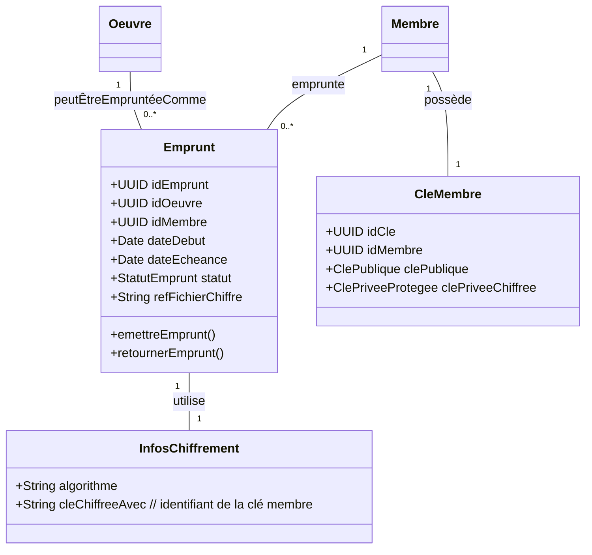

```mermaid
classDiagram
class Emprunt {
  +UUID idEmprunt
  +UUID idOeuvre
  +UUID idMembre
  +Date dateDebut
  +Date dateEcheance
  +StatutEmprunt statut
  +String refFichierChiffre
  +emettreEmprunt()
  +retournerEmprunt()
}

class CleMembre {
  +UUID idCle
  +UUID idMembre
  +ClePublique clePublique
  +ClePriveeProtegee clePriveeChiffree
}

class InfosChiffrement {
  +String algorithme
  +String cleChiffreeAvec // identifiant de la clé membre
}

Oeuvre "1" -- "0..*" Emprunt : peutÊtreEmpruntéeComme
Membre "1" -- "0..*" Emprunt : emprunte
Emprunt "1" -- "1" InfosChiffrement : utilise
Membre "1" -- "1" CleMembre : possède
```
