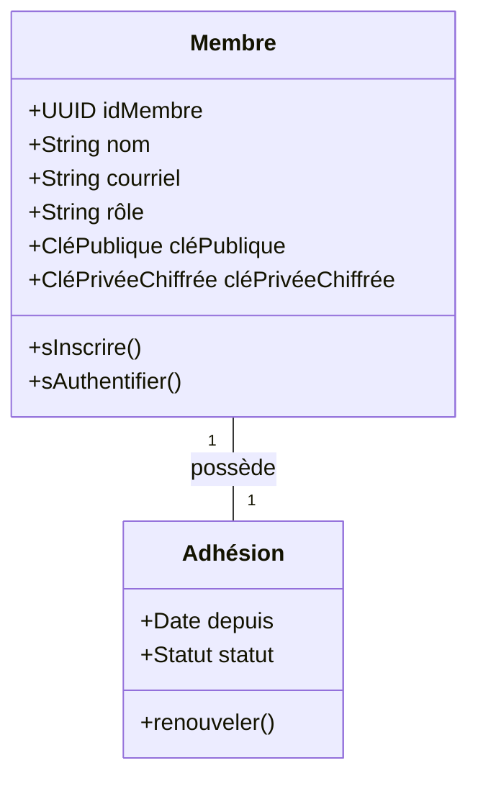

```mermaid
classDiagram
class Membre {
  +UUID idMembre
  +String nom
  +String courriel
  +String rôle
  +CléPublique cléPublique
  +CléPrivéeChiffrée cléPrivéeChiffrée
  +sInscrire()
  +sAuthentifier()
}

class Adhésion {
  +Date depuis
  +Statut statut
  +renouveler()
}

Membre "1" -- "1" Adhésion : possède

```
