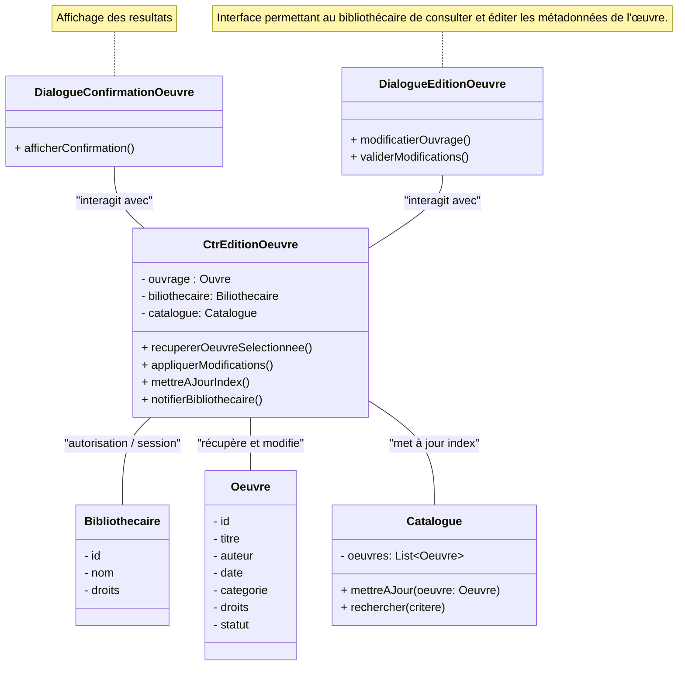

```mermaid
classDiagram
%% ===============================
%% Diagramme de Classes du Problème (DCP)
%% Cas d’utilisation : Modifier les informations concernant une oeuvre
%% ===============================

%% --- Dialogues (IHM) ---
class DialogueEditionOeuvre {
  + modificatierOuvrage()
  + validerModifications()
}

%% --- Dialogues (IHM) ---
class DialogueConfirmationOeuvre {
  + afficherConfirmation()
}

%% --- Contrôles ---
class CtrEditionOeuvre {
  - ouvrage : Ouvre
  - biliothecaire: Biliothecaire
  - catalogue: Catalogue
  + recupererOeuvreSelectionnee()
  + appliquerModifications()
  + mettreAJourIndex()
  + notifierBibliothecaire()
}

%% --- Entités (métier) ---
class Bibliothecaire {
  - id
  - nom
  - droits
}

class Oeuvre {
  - id
  - titre
  - auteur
  - date
  - categorie
  - droits
  - statut
}

class Catalogue {
  - oeuvres: List~Oeuvre~
  + mettreAJour(oeuvre: Oeuvre)
  + rechercher(critere)
}

%% --- Relations (liens fonctionnels) ---
DialogueConfirmationOeuvre -- CtrEditionOeuvre : "interagit avec"
DialogueEditionOeuvre -- CtrEditionOeuvre : "interagit avec"

CtrEditionOeuvre -- Bibliothecaire : "autorisation / session"
CtrEditionOeuvre -- Oeuvre : "récupère et modifie"
CtrEditionOeuvre -- Catalogue : "met à jour index"

%% --- Notes UML ---
note for DialogueEditionOeuvre "Interface permettant au bibliothécaire de consulter et éditer les métadonnées de l'œuvre."
note for DialogueConfirmationOeuvre "Affichage des resultats"
```