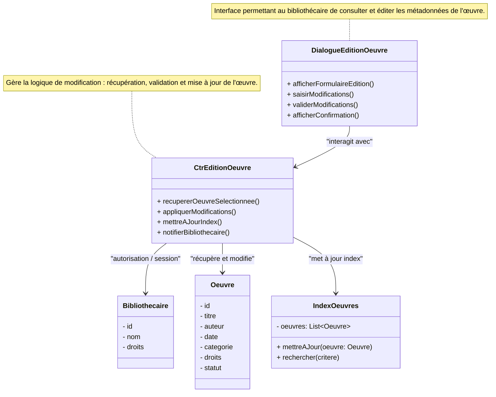

```mermaid
classDiagram
%% ===============================
%% Diagramme de Classes du Problème (DCP)
%% Cas d’utilisation : Modifier les informations concernant une oeuvre
%% ===============================

%% --- Dialogues (IHM) ---
class DialogueEditionOeuvre {
  + afficherFormulaireEdition()
  + saisirModifications()
  + validerModifications()
  + afficherConfirmation()
}

%% --- Contrôles ---
class CtrEditionOeuvre {
  + recupererOeuvreSelectionnee()
  + appliquerModifications()
  + mettreAJourIndex()
  + notifierBibliothecaire()
}

%% --- Entités (métier) ---
class Bibliothecaire {
  - id
  - nom
  - droits
}

class Oeuvre {
  - id
  - titre
  - auteur
  - date
  - categorie
  - droits
  - statut
}

class IndexOeuvres {
  - oeuvres: List~Oeuvre~
  + mettreAJour(oeuvre: Oeuvre)
  + rechercher(critere)
}

%% --- Relations (liens fonctionnels) ---
DialogueEditionOeuvre --> CtrEditionOeuvre : "interagit avec"

CtrEditionOeuvre --> Bibliothecaire : "autorisation / session"
CtrEditionOeuvre --> Oeuvre : "récupère et modifie"
CtrEditionOeuvre --> IndexOeuvres : "met à jour index"

%% --- Notes UML ---
note for CtrEditionOeuvre "Gère la logique de modification : récupération, validation et mise à jour de l'œuvre."
note for DialogueEditionOeuvre "Interface permettant au bibliothécaire de consulter et éditer les métadonnées de l'œuvre."
```