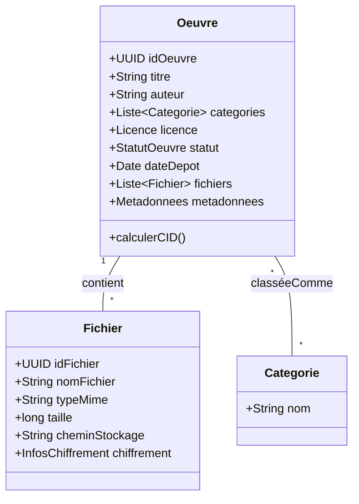

```mermaid
classDiagram
class Oeuvre {
  +UUID idOeuvre
  +String titre
  +String auteur
  +Liste~Categorie~ categories
  +Licence licence
  +StatutOeuvre statut
  +Date dateDepot
  +Liste~Fichier~ fichiers
  +Metadonnees metadonnees
  +calculerCID()
}

class Categorie {
  +String nom
}

class Fichier {
  +UUID idFichier
  +String nomFichier
  +String typeMime
  +long taille
  +String cheminStockage
  +InfosChiffrement chiffrement
}

Oeuvre "1" -- "*" Fichier : contient
Oeuvre "*" -- "*" Categorie : classéeComme
```