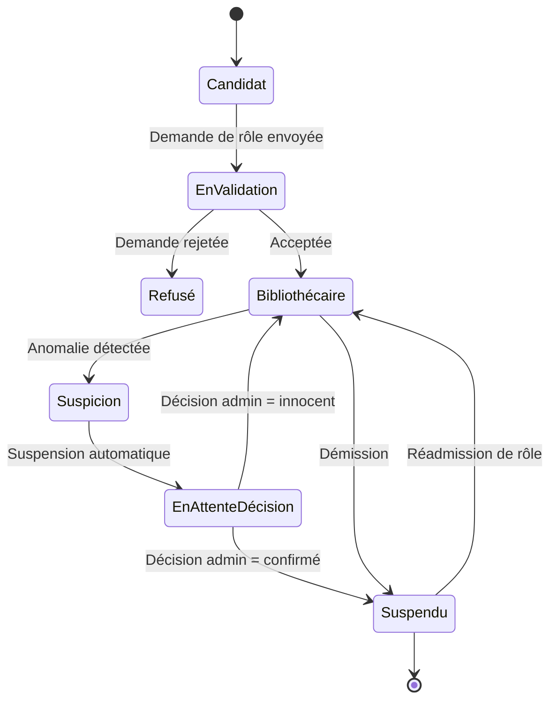

# Diagramme d'états transitions pour le Bibliothécaire

```mermaid
stateDiagram-v2
    [*] --> Candidat
    Candidat --> EnValidation : Demande de rôle envoyée
    EnValidation --> Refusé : Demande rejetée
    EnValidation --> Bibliothécaire : Acceptée
    Bibliothécaire --> Suspicion : Anomalie détectée
    Suspicion --> EnAttenteDécision : Suspension automatique
    EnAttenteDécision --> Bibliothécaire : Décision admin = innocent
    EnAttenteDécision --> Suspendu : Décision admin = confirmé
    Suspendu --> Bibliothécaire : Réadmission de rôle
    Bibliothécaire --> Suspendu : Démission
    Suspendu --> [*]
```
