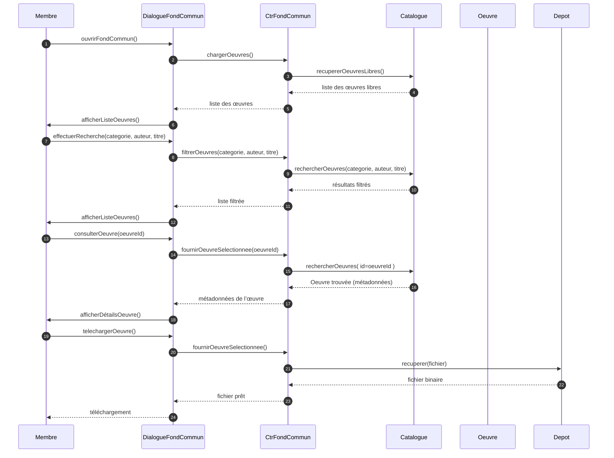

```mermaid
sequenceDiagram
    autonumber

    participant M as Membre
    participant DFC as DialogueFondCommun
    participant CFC as CtrFondCommun
    participant Cat as Catalogue
    participant O as Oeuvre
    participant Dep as Depot

    %% --- Ouverture de la rubrique Fond Commun ---
    M->>DFC: ouvrirFondCommun()
    DFC->>CFC: chargerOeuvres()

    CFC->>Cat: recupererOeuvresLibres()
    Cat-->>CFC: liste des œuvres libres
    CFC-->>DFC: liste des œuvres
    DFC->>M: afficherListeOeuvres()

    %% --- Recherche ---
    M->>DFC: effectuerRecherche(categorie, auteur, titre)
    DFC->>CFC: filtrerOeuvres(categorie, auteur, titre)

    CFC->>Cat: rechercherOeuvres(categorie, auteur, titre)
    Cat-->>CFC: résultats filtrés
    CFC-->>DFC: liste filtrée
    DFC->>M: afficherListeOeuvres()

    %% --- Consultation d'une œuvre ---
    M->>DFC: consulterOeuvre(oeuvreId)
    DFC->>CFC: fournirOeuvreSelectionnee(oeuvreId)

    CFC->>Cat: rechercherOeuvres( id=oeuvreId )
    Cat-->>CFC: Oeuvre trouvée (métadonnées)
    CFC-->>DFC: métadonnées de l’œuvre
    DFC->>M: afficherDétailsOeuvre()

    %% --- Téléchargement ---
    M->>DFC: telechargerOeuvre()
    DFC->>CFC: fournirOeuvreSelectionnee()

    CFC->>Dep: recuperer(fichier)
    Dep-->>CFC: fichier binaire
    CFC-->>DFC: fichier prêt
    DFC-->>M: téléchargement

```