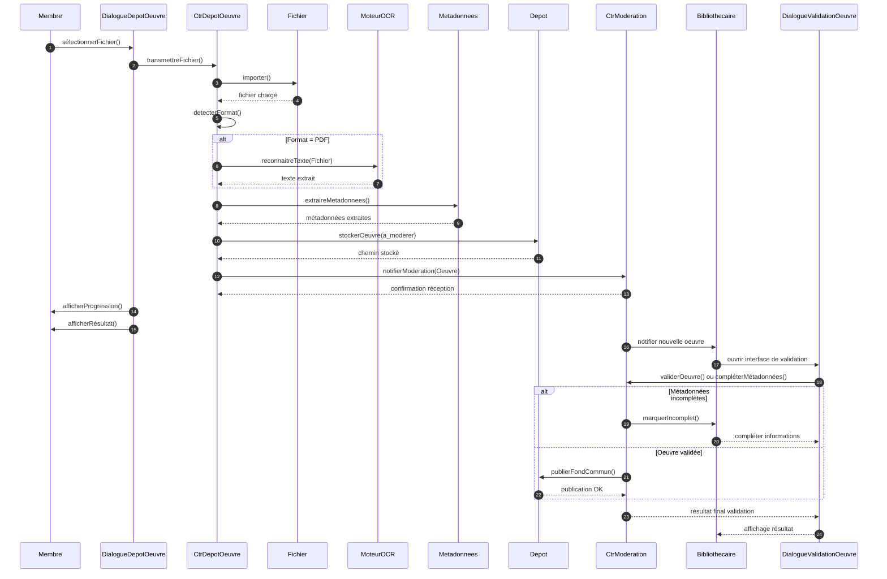

```mermaid
sequenceDiagram
    autonumber

    participant M as Membre
    participant DD as DialogueDepotOeuvre
    participant CD as CtrDepotOeuvre
    participant F as Fichier
    participant OCR as MoteurOCR
    participant MD as Metadonnees
    participant D as Depot
    participant CM as CtrModeration
    participant DB as Bibliothecaire
    participant DV as DialogueValidationOeuvre

    %% --- Étape 1 : Dépôt ---
    M->>DD: sélectionnerFichier()
    DD->>CD: transmettreFichier()

    CD->>F: importer()
    F-->>CD: fichier chargé

    CD->>CD: detecterFormat()

    alt Format = PDF
        CD->>OCR: reconnaitreTexte(Fichier)
        OCR-->>CD: texte extrait
    end

    CD->>MD: extraireMetadonnees()
    MD-->>CD: métadonnées extraites

    CD->>D: stockerOeuvre(a_moderer)
    D-->>CD: chemin stocké

    CD->>CM: notifierModeration(Oeuvre)
    CM-->>CD: confirmation réception

    DD->>M: afficherProgression()
    DD->>M: afficherRésultat()

    %% --- Étape 2 : Validation / Modération ---
    CM->>DB: notifier nouvelle oeuvre
    DB->>DV: ouvrir interface de validation
    DV->>CM: validerOeuvre() ou compléterMétadonnées()

    alt Métadonnées incomplètes
        CM->>DB: marquerIncomplet()
        DB-->>DV: compléter informations
    else Oeuvre validée
        CM->>D: publierFondCommun()
        D-->>CM: publication OK
    end

    CM-->>DV: résultat final validation
    DV-->>DB: affichage résultat
```