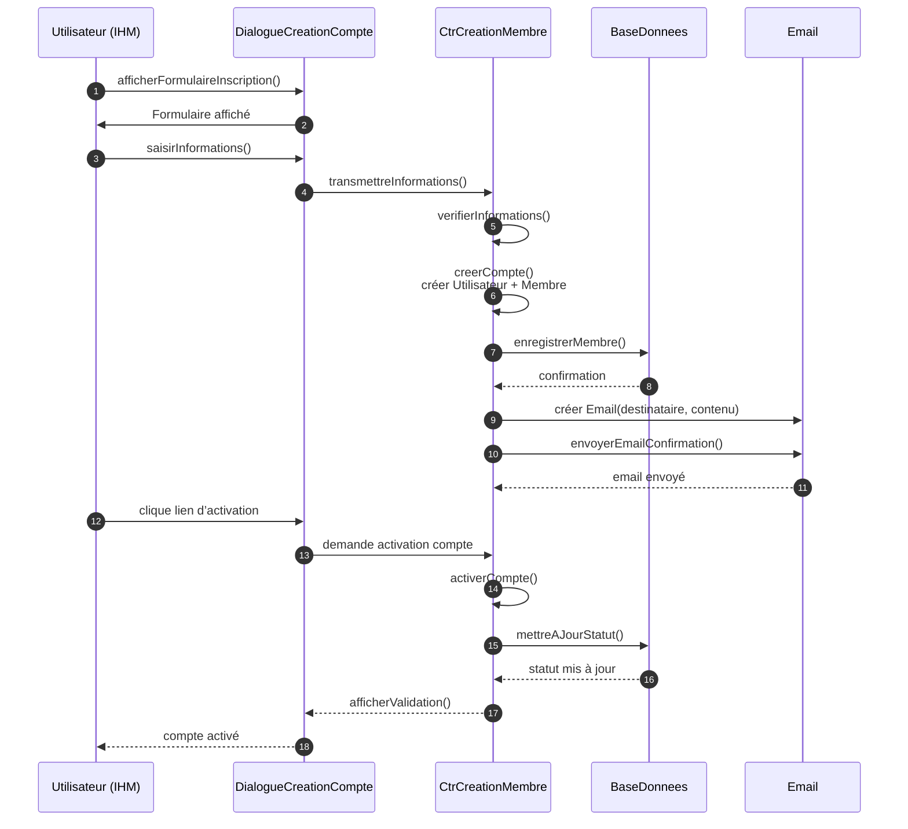

```mermaid
sequenceDiagram
    autonumber

    participant U as Utilisateur (IHM)
    participant D as DialogueCreationCompte
    participant C as CtrCreationMembre
    participant BD as BaseDonnees
    participant E as Email

    %% --- Inscription ---
    U->>D: afficherFormulaireInscription()
    D->>U: Formulaire affiché

    U->>D: saisirInformations()
    D->>C: transmettreInformations()

    C->>C: verifierInformations()

    C->>C: creerCompte() <br/> créer Utilisateur + Membre

    C->>BD: enregistrerMembre()
    BD-->>C: confirmation

    %% --- Envoi email ---
    C->>E: créer Email(destinataire, contenu)
    C->>E: envoyerEmailConfirmation()
    E-->>C: email envoyé

    %% --- Activation du compte ---
    U->>D: clique lien d’activation
    D->>C: demande activation compte

    C->>C: activerCompte()
    C->>BD: mettreAJourStatut()
    BD-->>C: statut mis à jour

    C-->>D: afficherValidation()
    D-->>U: compte activé
```