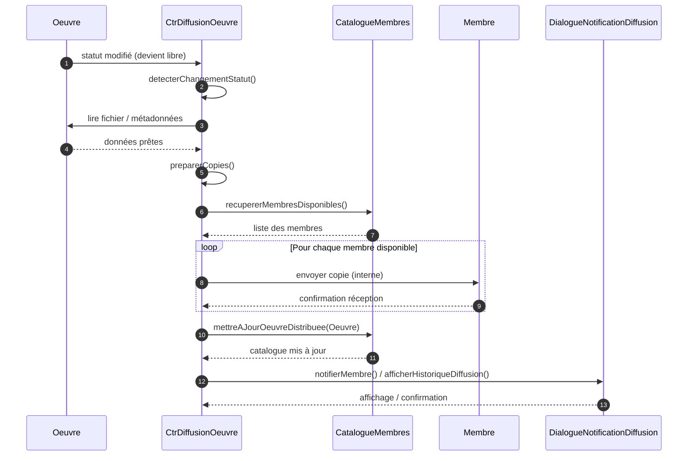

```mermaid
sequenceDiagram
    autonumber

    participant O as Oeuvre
    participant CDO as CtrDiffusionOeuvre
    participant CM as CatalogueMembres
    participant M as Membre
    participant DND as DialogueNotificationDiffusion

    %% --- Détection du changement de statut ---
    O->>CDO: statut modifié (devient libre)
    CDO->>CDO: detecterChangementStatut()

    %% --- Préparation des copies ---
    CDO->>O: lire fichier / métadonnées
    O-->>CDO: données prêtes
    CDO->>CDO: preparerCopies()

    %% --- Sélection des membres participants ---
    CDO->>CM: recupererMembresDisponibles()
    CM-->>CDO: liste des membres

    %% --- Distribution interne (sans P2P) ---
    loop Pour chaque membre disponible
        CDO->>M: envoyer copie (interne)
        M-->>CDO: confirmation réception
    end

    %% --- Mise à jour du catalogue ---
    CDO->>CM: mettreAJourOeuvreDistribuee(Oeuvre)
    CM-->>CDO: catalogue mis à jour

    %% --- Notification (optionnelle) ---
    CDO->>DND: notifierMembre() / afficherHistoriqueDiffusion()
    DND-->>CDO: affichage / confirmation
```