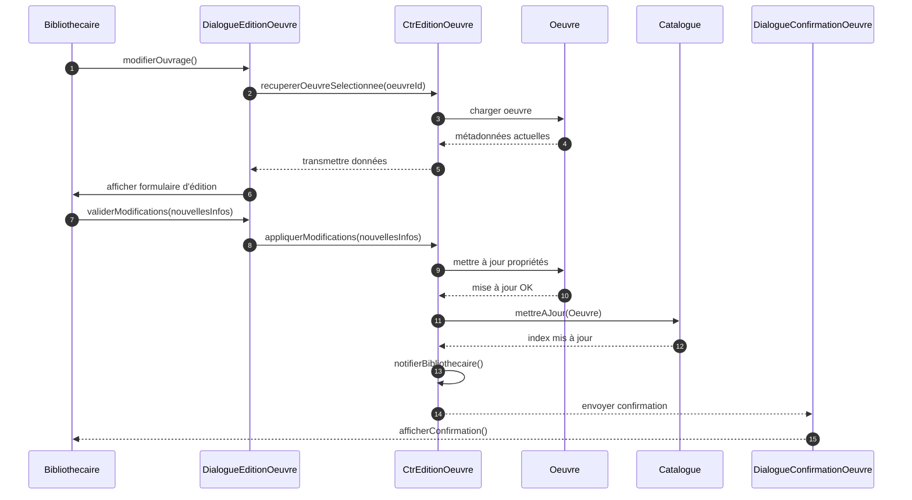

```mermaid
sequenceDiagram
    autonumber

    participant B as Bibliothecaire
    participant DE as DialogueEditionOeuvre
    participant CE as CtrEditionOeuvre
    participant O as Oeuvre
    participant Cat as Catalogue
    participant DC as DialogueConfirmationOeuvre

    %% --- Ouverture de l'édition ---
    B->>DE: modifierOuvrage()
    DE->>CE: recupererOeuvreSelectionnee(oeuvreId)

    CE->>O: charger oeuvre
    O-->>CE: métadonnées actuelles
    CE-->>DE: transmettre données
    DE->>B: afficher formulaire d'édition

    %% --- Modification par le bibliothécaire ---
    B->>DE: validerModifications(nouvellesInfos)
    DE->>CE: appliquerModifications(nouvellesInfos)

    CE->>O: mettre à jour propriétés
    O-->>CE: mise à jour OK

    %% --- Mise à jour du catalogue ---
    CE->>Cat: mettreAJour(Oeuvre)
    Cat-->>CE: index mis à jour

    %% --- Notification et confirmation ---
    CE->>CE: notifierBibliothecaire()
    CE-->>DC: envoyer confirmation
    DC-->>B: afficherConfirmation()

```